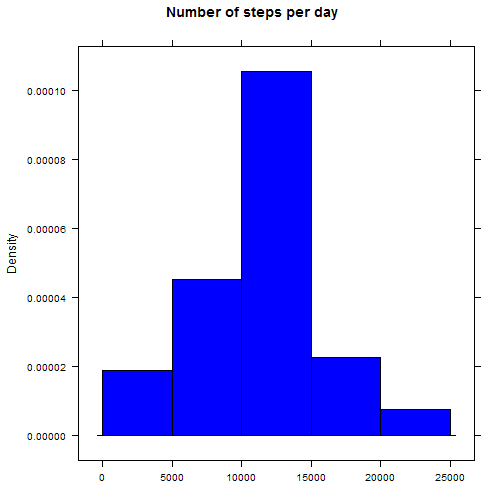
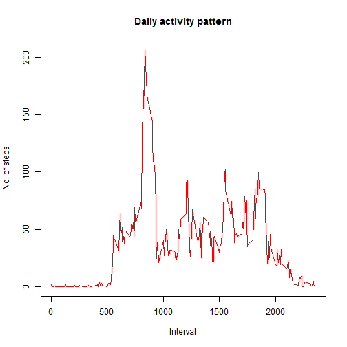
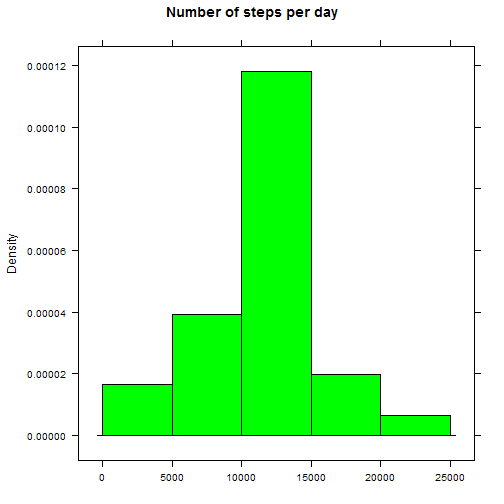
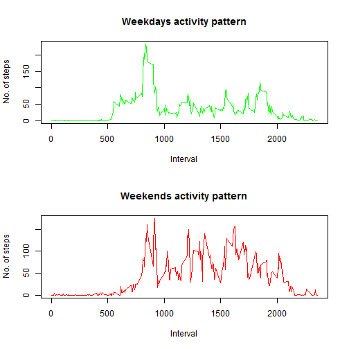

## Loading and preprocessing the data

```r
unzip("activity.zip")
data <- read.csv("Activity.csv")
library(lattice)
```


## What is mean total number of steps taken per day?

```r
sum.byDays <- aggregate(data$steps, list(data$date), sum)
names(sum.byDays) <- c("day", "steps")
histogram( ~ steps, data = sum.byDays, type="density", breaks = 5)
```

 

- The mean is:

```r
mean(sum.byDays$steps, na.rm=T)
```

```
## [1] 10766.19
```
- The median is:

```r
median(sum.byDays$steps, na.rm=T)
```

```
## [1] 10765
```


## What is the average daily activity pattern?

```r
avg.byInts <- aggregate(steps ~ interval, data = data, mean)
xyplot(steps ~ interval, data = avg.byInts, type="l",
       main = "Daily activity pattern", xlab="Interval", ylab="No. of steps",
       col="red")
```

 

- The maximum average number of steps per 5-minute interval:

```r
steps.avg.max <- max(avg.byInts$steps)
max.interval <- avg.byInts[avg.byInts$steps == steps.avg.max, "interval"]
```

The average maximum number of steps is 206.1698113, and the interval id that contains this value is 835.

## Imputing missing values
To replace the missing values, we're going to use rounded mean values for these intervals.
So, the strategy is:

1. Take the mean values (_avg.byInts_)

2. Round them and pack to a data.frame w/rows indexed by interval id.

3. Substitute all NAs in original _data_ with corresponding values.

```r
ints.Avg <- data.frame(round(avg.byInts$steps), row.names = avg.byInts$interval)
names(ints.Avg) <- c("steps")

data.Imp <- data
i <- 1
while (i <= nrow(data.Imp))
{
        if (is.na(data.Imp$steps[i]))
        {
                data.Imp$steps[i] <- ints.Avg[as.character(data.Imp$interval[i]), "steps"]
        }
        i <- i + 1
}

sum.byDays <- aggregate(data.Imp$steps, list(data.Imp$date), sum)
names(sum.byDays) <- c("day", "steps")
histogram( ~ steps, data = sum.byDays, type="density", breaks = 5,
           xlab="", col="green", main = "Number of steps per day")
```

 

- The mean is:

```r
mean(sum.byDays$steps, na.rm=T)
```

```
## [1] 10765.64
```

- The median is:

```r
median(sum.byDays$steps, na.rm=T)
```

```
## [1] 10762
```


## Are there differences in activity patterns between weekdays and weekends?

```r
## setting locale to get english names for weekdays
Sys.setlocale("LC_TIME", "English")
```

```
## [1] "English_United States.1252"
```

```r
days <- sapply(as.Date(data$date), weekdays)

## vector of weekdays (not weekends)
wd <- c("Monday", "Tuesday", "Wednesday", "Thursday", "Friday")
i = 1
len = length(days)
while (i <= len) {
        if (days[i] %in% wd) days[i] <- "weekday"
        else days[i] <- "weekend"
        i <- i + 1
}
days <- as.factor(days)

xyplot(steps ~ interval | days, data = data, panel = function(x, y) {
    tmp.data <- cbind(x,y)
    tmp.data.mean <- aggregate(y ~ x, data = tmp.data, mean)
    panel.xyplot(tmp.data.mean$x, tmp.data.mean$y, type="l")
}, xlab="Interval", ylab="No. of steps", layout = c(1, 2))
```

 
