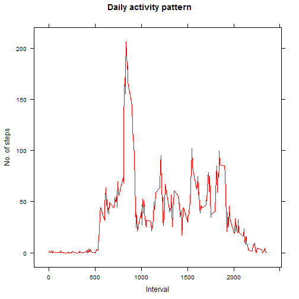
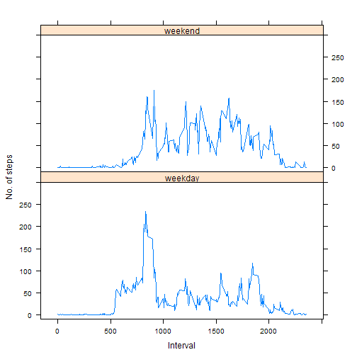

## Loading and preprocessing the data

```r
unzip("activity.zip")
data <- read.csv("Activity.csv")
```
## What is mean total number of steps taken per day?

```r
sum.byDays <- aggregate(data$steps, list(data$date), sum)
hist(sum.byDays$x, xlab="", col="blue", main = "Number of steps per day")
```

 

- The mean is:

```r
mean(sum.byDays$x, na.rm=T)
```

```
## [1] 10766.19
```
- The median is:

```r
median(sum.byDays$x, na.rm=T)
```

```
## [1] 10765
```


## What is the average daily activity pattern?

```r
avg.byInts <-aggregate(steps ~ interval, data = data, mean)
plot(avg.byInts, type = "l", main = "Daily activity pattern", col="red",
     xlab="Interval", ylab="No. of steps")
```

 

- The maximum average number of steps per 5-minute interval:

```r
max(avg.byInts$steps)
```

```
## [1] 206.1698
```

## Imputing missing values

```r
ints.Avg <- data.frame(round(avg.byInts$steps), row.names = avg.byInts$interval)
names(ints.Avg) <- c("steps")

data.Imp <- data
i <- 1
while (i <= nrow(data.Imp))
{
        if (is.na(data.Imp$steps[i]))
        {
                data.Imp$steps[i] <- ints.Avg[as.character(data.Imp$interval[i]), "steps"]
        }
        i <- i + 1
}

sum.byDays <- aggregate(data.Imp$steps, list(data.Imp$date), sum)
hist(sum.byDays$x, xlab="", col="green", main = "Number of steps per day")
```

 

- The mean is:

```r
mean(sum.byDays$x, na.rm=T)
```

```
## [1] 10765.64
```

- The median is:

```r
median(sum.byDays$x, na.rm=T)
```

```
## [1] 10762
```


## Are there differences in activity patterns between weekdays and weekends?

```r
## setting locale to get english names for weekdays
Sys.setlocale("LC_TIME", "English")
```

```
## [1] "English_United States.1252"
```

```r
days <- sapply(as.Date(data$date), weekdays)

## vector of weekdays (not weekends)
wd <- c("Monday", "Tuesday", "Wednesday", "Thursday", "Friday")
i = 1
len = length(days)
while (i <= len) {
        if (days[i] %in% wd) days[i] <- "weekday"
        else days[i] <- "weekend"
        i <- i + 1
}
days <- as.factor(days)

data <- cbind(data, days)
avg.byIntsWeekday <- aggregate(steps ~ interval, data = data, mean, subset = days == "weekday")
avg.byIntsWeekend <- aggregate(steps ~ interval, data = data, mean, subset = days == "weekend")

par(mfrow = c(2,1))
plot(avg.byIntsWeekday, type = "l", main = "Weekdays activity pattern", col="green",
     xlab="Interval", ylab="No. of steps")
plot(avg.byIntsWeekend, type = "l", main = "Weekends activity pattern", col="red",
     xlab="Interval", ylab="No. of steps")
```

 
